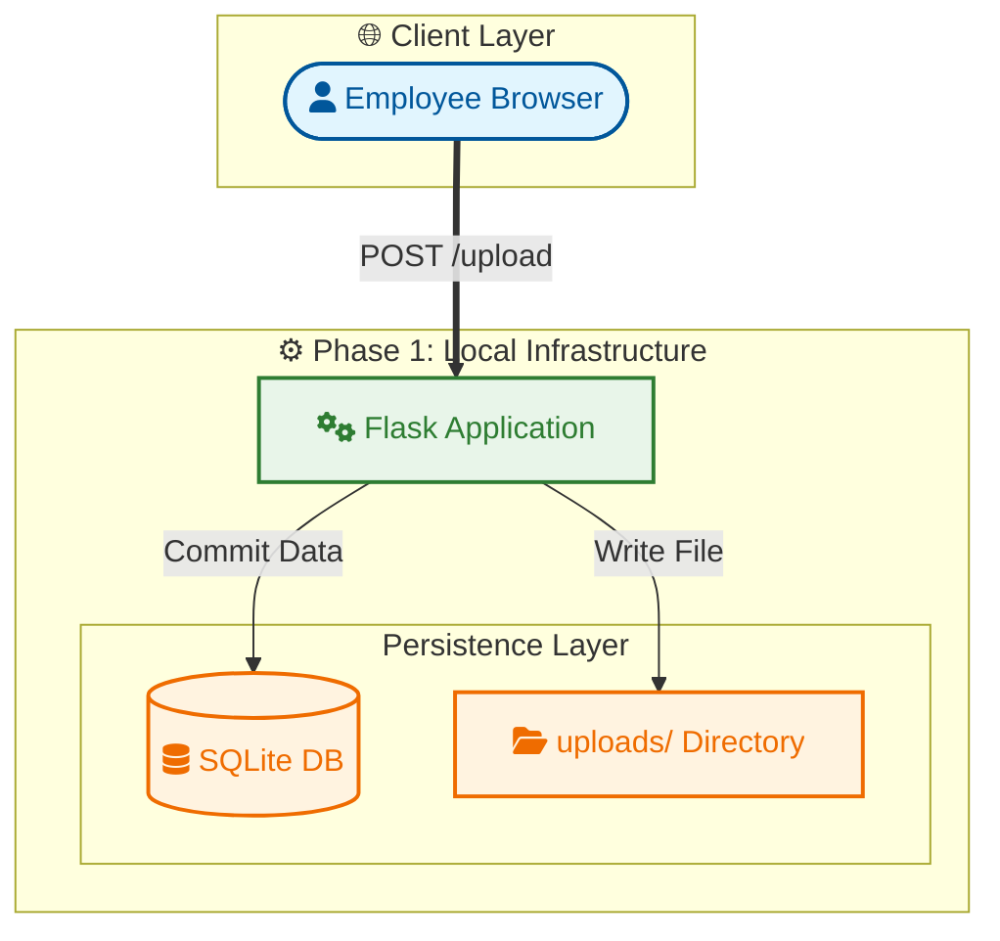

# Cloud-Native Employee Document Portal (Evolutionary Project)

## Project Overview
This project is a simulation of a real-world **Enterprise Document Management System**. The goal is to build a scalable, secure web application where employees can register their details and securely upload documents (Resumes/IDs).

**The twist:** This is an **Evolutionary DevOps Project**. Instead of building the complex infrastructure immediately, I am building it in strict phases to demonstrate mastery over the entire Software Development Life Cycle (SDLC):

---
### ⚠️ This project is intentionally built in phases. Each phase is available as a separate Git branch to showcase real-world system evolution.
---

1.  **Local Development (Current Phase)**
2.  Containerization (Docker)
3.  Orchestration (Kubernetes)
4.  Cloud Integration (AWS S3 & RDS)
5.  Automation (CI/CD Pipelines)

---

## 🏗️ Phase 1: Local Development Architecture
In this initial phase, the focus was on writing clean application logic using Python (Flask) without worrying about complex infrastructure.

### Tech Stack (Phase 1)
* **Language:** Python 3.10
* **Framework:** Flask (Lightweight Web Framework)
* **Database:** SQLite (Local file-based database `employees.db`)
* **File Storage:** Local Server Storage (`uploads/` directory)
* **Frontend:** HTML5 + CSS

### Architecture Diagram


## Setup & Installation
### Prerequisites

- Linux (Ubuntu/Debian)
- Python 3.10+
- Pip

### Step 1: Environment Setup
I strictly follow best practices by isolating dependencies in a Virtual Environment.

```
Bash

# Update system and install python3-venv 
sudo apt update
sudo apt install python3-venv

# Create virtual environment (Do NOT use sudo here)
python3 -m venv venv

# Activate the environment
source venv/bin/activate
```

### Step 2: Install Dependencies
``` Bash
pip install -r requirements.txt

```

### Step 3: Run the Application
``` Bash
python app.py
```
- The app will start running at `http://localhost:5000`


## 🛠️ Challenges & Troubleshooting

### The Issue: **Virtual Environment Failure** Error Message:

`The virtual environment was not created successfully because ensurepip is not available.
`

**Context:**
- On Ubuntu/Debian systems, the venv module is often pre-installed but stripped of the ensurepip tool to save space. When I tried to run python3 -m venv venv, it failed. I initially tried forcing it with `sudo`, which caused `permission errors` later.

### Solution: Install the missing package:
---
``` Bash
sudo apt install python3-venv
```

Clean up: Removed the corrupted venv folder created by sudo.

``` Bash
sudo rm -rf venv
```
`Re-create correctly:` Created the new environment as a standard user `(without sudo)` to ensure I have full read/write permissions for installing packages.


📂 Project Structure
``` Plaintext

employee-portal/
├── app.py                # Main Application Logic (Routes & DB Models)
├── requirements.txt      # Project Dependencies
├── templates/
│   └── index.html        # Frontend UI
├── uploads/              # (Generated) Stores uploaded resumes locally
└── instance
    └── employees.db          # (Generated) SQLite Database file
```